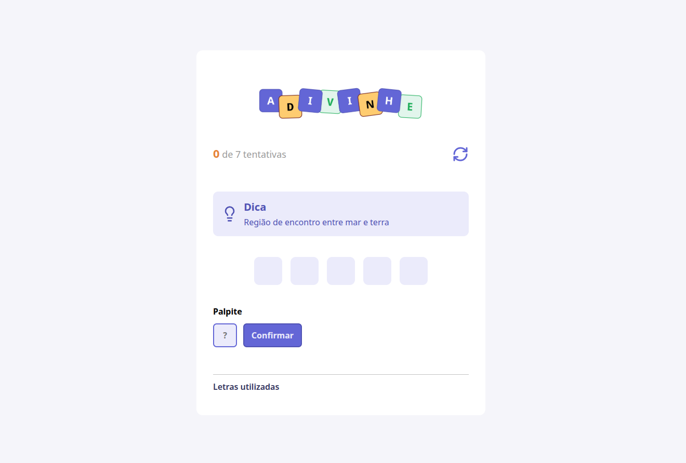

# **🧩 Adivinhe**

## Este projeto foi desenvolvido durante a trilha **Full-Stack** da **Rocketseat**. Ele simula um **jogo de adivinhação**, onde o usuário deve descobrir palavras com base em dicas fornecidas e um número limitado de tentativas.

## 🚀 **Tecnologias Usadas**

- **React**: Biblioteca JavaScript para construção de interfaces de usuário.
- **TypeScript**: Para garantir a tipagem e maior segurança no desenvolvimento.
- **CSS Modules**: Para aplicação de estilos locais e manutenção do isolamento dos estilos.
- **Vite**: Ferramenta de build e desenvolvimento rápido.

---

## ⚙️ **Funcionalidades**

- **Adivinhar palavras**: advinhe palavras com base em dicas fornecidas.
- **Controle**: o usuário pode ver o número de tentativas disponíveis.
- **Feedback**: tenha o retorno imediato sobre as tentativas corretas e erradas.
- **Responsividade completa**: Layout ajustado para diferentes tamanhos de tela.

---

## 🎯 **Objetivos**

- Praticar o uso de **estados** no **React**.
- Praticar o gerenciamento de **estado** e **eventos** no **React**.
- Trabalhar com **componentização** e **reutilização de código**.
- Aprimorar a lógica de jogo utilizando **arrays** e **condicionais**.

---

## 🖼 **Layout do Projeto**

